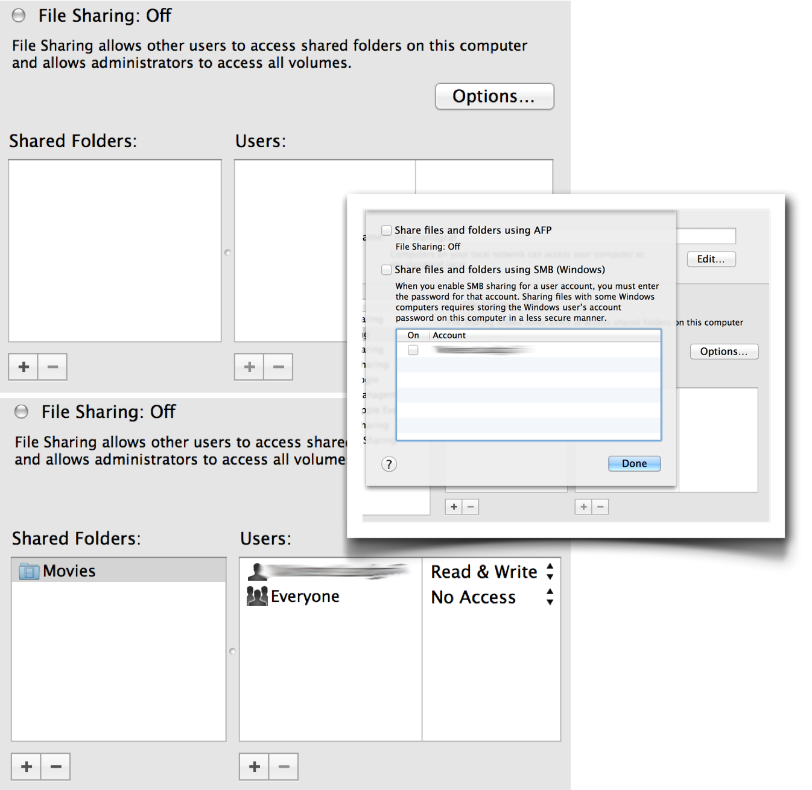
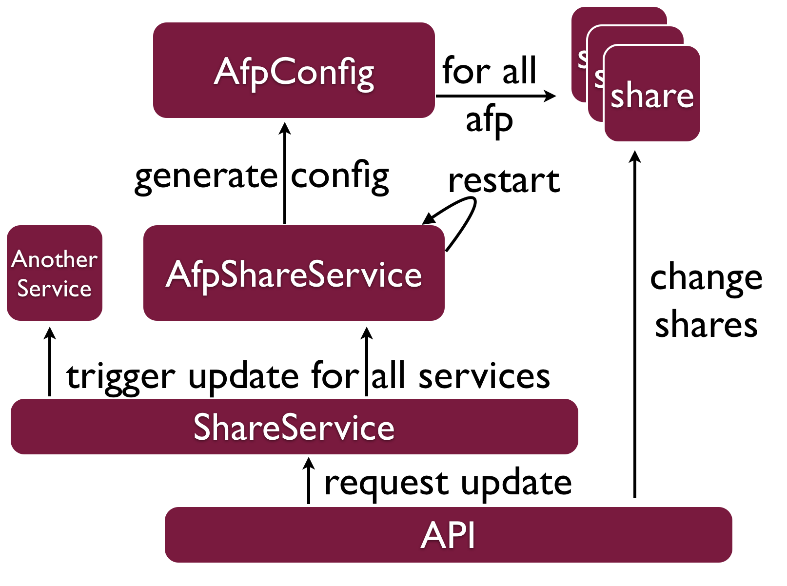

# rubynas

## Getting Started

To start developing simply start foreman:

    foreman start

And go to your webbrowser at: 

    http://127.0.0.1:5100/

Login with one of the users in the ldap:

    email: admin@rubynas.com or user@rubynas.com
    password: secret

## Run the tests

Since the tests depend on the LDAP you have to start it first with:

    foreman start

Then use either:

    rake spec
    rake
    rspec spec

## Directories

This project has a typical rails layout plus:

* **debian** for debian deployment
* **deploy** containing system configs and foreman tempalte
* **sandbox** place for local ldap server and the like

## Development & Vagrant

The vagrant box is setup so that one can test the current application state on the box. To get startet create the box and deploy the application with its services:

    vagrant up

Install build dependencies:

    cap deploy:setup

Install and configure LDAP:

    cap deploy:services

Build and install the service:

    cap deploy:debian

# rubynas Shares

The following section describes how shares "should be/are" implemented in rubynas.

The general idea more or less oriented how mac os x is handling shares with a bit more flexibility. Here a short reminder on that:

Basically we can create a share which has a location and users or groups that can access it. Unlike mac os x the user can specify in which way the share is exposed. In other words it should be possible to tell per share if it can be accessed by AFP, SMB etc.

## Share Entity

Bases on the idea above we got the following structure:

* Name (String) Name of the share
* Path (String) Posix path to the share
* Permissions (Array<Permission>) A list with users, groups that have access to the share
* Services (Array<Service>) A list of services that should expose the share. Imagine the following list:
  * NFS
  * AFP
  * RSYNC
  * SMB
  * CIFS
* Options (Hash<Service, Hash>) A hash of options extra for each of the sharing services.
  
### Permission Entity

A Permission is either based on a group or user. The reference to the **ldap user** and **ldap group** has to be made using the **common name**.

* Read (Boolean) true if the permissions grants read access
* Write (Boolean) true if the permission grants write access
* User (LdapUser) the ldap user that is permitted
* Group (LdapGroup) the ldap user that is permitted

## Interaction

To actually apply the share configuration to the services there are several layers which control the sharing service (aftp, smb, ...) and it's configuration. Here a quick visualization, of the layers (the api is the initiator):

The shares API which is instrumented by the frontend, it manipulates the share models. This means creating, updating and changing shares. After the API did a manipulation to the shares it will call `ShareService.update_all` which will trigger an update on each and every service.

Speaking of a sharing service: It needs to inherit from `ShareService` and implement the `#update!` method like this example:

    class AfpShareService < ShareService
      service_name :netatalk
  
      def update!
        if AfpServiceConfiguration.update
          restart # supplied by base class
        end
      end
    end

The update basically creates a new rendered version of the configuration and makes a hash on the content. Next it checkes if the old config has the same hash, if it does, `false` is returned and nothing happens. If the hash is different the configuration will be replaced and update returns `true` so that the service is going to be restarted.

In order for a `ShareService` to be so simple a lot of magic needs to happen in the background. This will be described further below. Now regarding the configuration:

    class AfpServiceConfiguration < ShareServiceConfiguration
      config_file 'afp.conf'
      
      def time_machine(share)
        share.options[self][:time_machine] ? 'yes' : 'no'
      end
    end
    
And here is the template for the configuration above:

    ;
    ; Netatalk 3.x configuration file
    ;

    [Global]
    ; log level = default:maxdebug
    log file = /var/log/netatalk
    uam list = uams_dhx.so uams_dhx2.so

    [Homes]
    basedir regex = /home
    
    <% @shares.each do |share| %>
    [<%= @share.name %>]
    path = <%= @share.path %>
    time machine = <%= time_machine(share) %>
    <% end %>

## Magic

The magic behind scenes is basically done by the superclasses. They know how to start the a service and where the configuration files are placed. Main part of that magic is the automatic system and configuration detection. This is described in the section OS.
